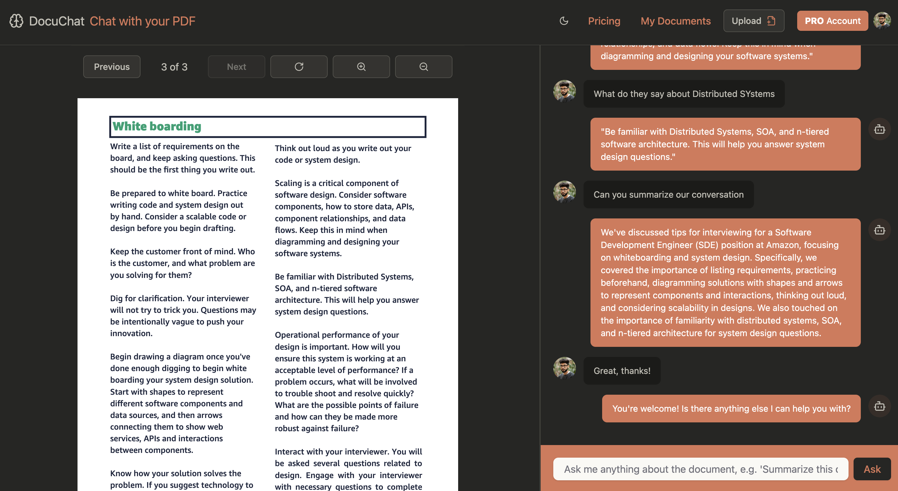

# DocuChat 🤖📄

> **Secure AI Conversations with your PDF documents**

DocuChat is a modern web application that allows users to have intelligent conversations with their PDF documents using AI. Upload any PDF, and get contextual answers based on your document content and chat history.

## Demo

[](https://docu-chat-eight.vercel.app/demo-video.mp4)

## Features

- **📄 PDF Upload & Processing**: Drag and drop PDF files with automatic processing
- **🤖 AI-Powered Chat**: Get intelligent answers based on your document content
- **🧠 Context-Aware Conversations**: AI remembers your chat history for better responses
- **👤 User Authentication**: Secure login with Clerk authentication
- **💳 Subscription Management**: Free and Pro tiers with Stripe integration
- **⚡ Real-time Updates**: Live chat interface with instant responses
- **🔒 Secure**: All data is encrypted and stored securely

## Tech Stack

### Frontend
- **Next.js 15** - React framework with App Router
- **TypeScript** - Type safety
- **Tailwind CSS** - Styling
- **Shadcn(Radix)** - Accessible Styled components
- **Framer Motion** - Animations

### Backend & AI
- **Google Gemini AI** - Primary AI model for chat completions
- **LangChain** - AI framework for document processing
- **Pinecone** - Vector database for embeddings
- **Firebase** - Database and file storage
- **Clerk** - Authentication
- **Stripe** - Payment processing

## Getting Started

### Prerequisites

- Node.js 18+
- npm, yarn, or bun
- Google AI API key
- Pinecone API key
- Firebase project
- Clerk account
- Stripe account (for payments)

### Installation

1. **Clone the repository**
   ```bash
   git clone https://github.com/yourusername/docuchat.git
   cd docuchat
   ```

2. **Install dependencies**
   ```bash
   npm install
   # or
   yarn install
   # or
   bun install
   ```

3. **Set up environment variables**
   Create a `.env.local` file in the root directory:
   ```env
   # AI APIs
   GOOGLE_API_KEY=your_google_ai_api_key
   OPENAI_API_KEY=your_openai_api_key
   
   # Vector Database
   PINECONE_API_KEY=your_pinecone_api_key
   
   # Authentication
   NEXT_PUBLIC_CLERK_PUBLISHABLE_KEY=your_clerk_publishable_key
   CLERK_SECRET_KEY=your_clerk_secret_key
   
   # Database & Storage
   FIREBASE_STORAGE_BUCKET=your_firebase_bucket
   
   # Payments
   STRIPE_API_KEY=your_stripe_secret_key
   NEXT_PUBLIC_STRIPE_PUBLISHABLE_KEY=your_stripe_publishable_key
   
   # Deployment
   VERCEL_URL=your_vercel_url
   ```

4. **Set up Firebase**
   - Create a Firebase project
   - Download your service account key as `service_key.json`
   - Place it in the root directory

5. **Run the development server**
   ```bash
   npm run dev
   # or
   yarn dev
   # or
   bun dev
   ```

6. **Open your browser**
   Navigate to [http://localhost:3000](http://localhost:3000)

## Configuration

### AI Models
The app uses Google's Gemini AI for chat completions. You can modify the model in `src/lib/langchain.ts`:

```typescript
export const googleAIModel = new ChatGoogleGenerativeAI({
  model: "gemini-1.5-pro", // Change model here
  apiKey: process.env.GOOGLE_API_KEY,
});
```

### Usage Limits
Modify usage limits in `src/actions/ask-question.ts`:

```typescript
const PRO_LIMIT = 20;    // Questions per document for Pro users
const FREE_LIMIT = 2;    // Questions per document for Free users
```

## 🚀 Deployment

### Vercel (Recommended)

1. Push your code to GitHub
2. Connect your repository to Vercel
3. Add environment variables in Vercel dashboard
4. Deploy!

### Manual Deployment

```bash
npm run build
npm start
```

## 📊 API Usage & Costs

### Current Architecture
- **Single API Key**: All users share your Google AI API key
- **Cost Management**: You pay for all API usage
- **Usage Limits**: Controlled through your application logic

### Cost Optimization
- Monitor your Google AI usage dashboard
- Set up billing alerts
- Consider implementing per-user API keys for scale

## 🤝 Contributing

1. Fork the repository
2. Create a feature branch (`git checkout -b feature/amazing-feature`)
3. Commit your changes (`git commit -m 'Add amazing feature'`)
4. Push to the branch (`git push origin feature/amazing-feature`)
5. Open a Pull Request